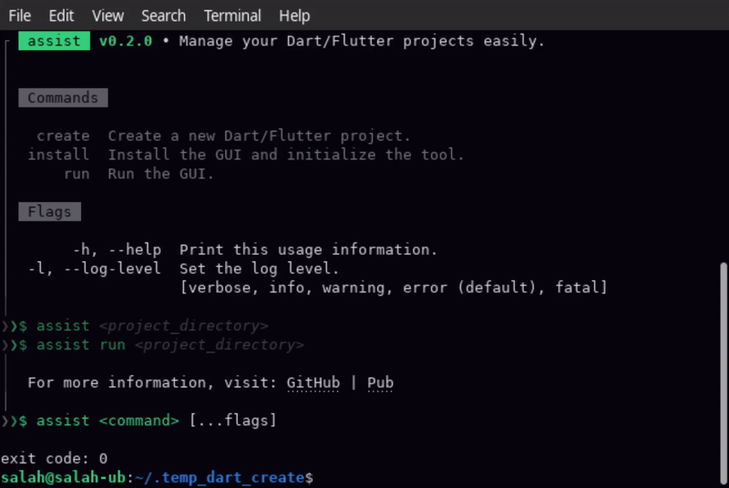

<div align="center">
  <a href="#">
    
  </a>
  <h1>Assist</h1>
  <p>
    A tool designed to simplify the management of Dart and Flutter projects. It automates repetitive tasks, improves developer experience, and ensures projects remain up-to-date.
  </p>
  <a href="https://github.com/salah-rashad/assist/issues/new?labels=bug&assignees=salah-rashad" target="_blank">
    Report Bug
  </a>
   · 
  <a href="https://github.com/salah-rashad/assist/issues/new?labels=enhancement&assignees=salah-rashad" target="_blank">
    Request Feature
  </a>
  <br/><br/>
  <a href="https://pub.dev/packages/assist/score" target="_blank">
    
    
    
  </a>
  <br/>
  <a href="https://thebsd.github.io/StandWithPalestine/" target="_blank">
    
  </a>
  <br/><br/>
</div>



Assist is ideal for developers looking to save time, reduce errors, and improve their overall
development workflow.

The tool is particularly useful for developers who want to streamline their workflows when working
with Dart packages on `pub.dev`.

#### 🚧 Under Development 🚧
> [!WARNING]
> This project is still in development and is not yet ready for production use.  
> Please use with caution and file any potential issues on [GitHub](https://github.com/salah-rashad/assist/issues).


## Key Features

- **Project Creation**: Interactive CLI for creating new Dart/Flutter projects.
- **Publishing Automation**: Automates `dart pub publish` with pre-publish checks.
- **Documentation Management**: Tools for building and editing `README.md` and `CHANGELOG.md`.
- **Pubspec Management**: Updates versions, dependencies, and package metadata.
- **Git Integration**: Verifies tags and manages workflows.
- **Code Quality**: Analyzes, formats, and tests code.

You can find the full list of goals and features in
the [GOALS.md](https://github.com/salah-rashad/assist/blob/main/GOALS.md) file.

## Installation

Run the following command to install:

```bash
dart pub global activate assist
```

## Usage

To start using Assist, run any of the following commands:

```bash
# Show the help menu
assist
# Create a new Dart/Flutter project
assist create
```

## Contributing

Contributions are welcome! Feel free to open issues or submit pull requests
on the [GitHub repository](https://github.com/salah-rashad/assist).

## License

This project is licensed under the BSD 3-Clause License.

<br/><br/>

<div align="center"> 
  Made with ❤️ in Egypt 🇪🇬
  <br/>
  <h3 align="center"> 🇵🇸 Free Palestine 🇵🇸 </h3>
</div>