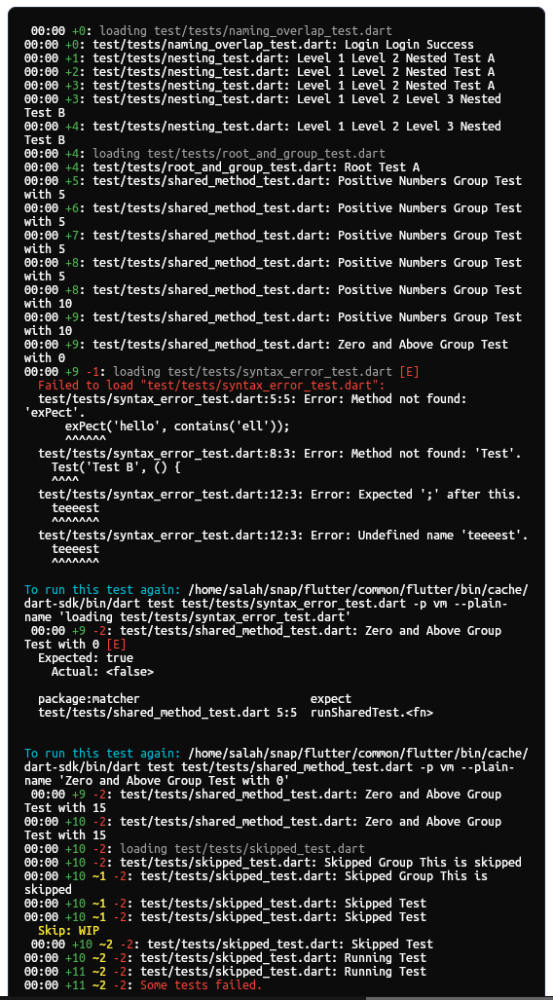
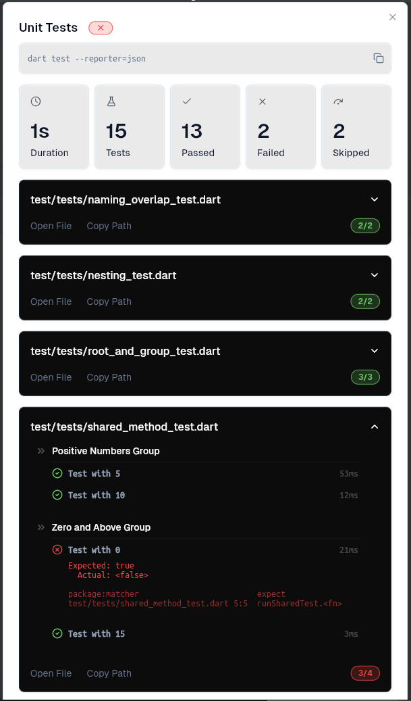

<a href="https://pub.dev/packages/assist" target="_blank">
    
    
    
</a>

[](https://github.com/salah-rashad/assist/actions/workflows/build_gui_release.yml)
[](https://github.com/salah-rashad/assist/actions/workflows/pull_request.yml)

---

#### 🚧 Under Development 🚧
> [!WARNING]
> This project is still in development and is not yet ready for production use.  
> Please use with caution and file any potential issues on [GitHub](https://github.com/salah-rashad/assist/issues).

---

## ✨ Why Assist?

Most Dart and Flutter devs repeat the same manual steps:

- Bump the version in `pubspec.yaml`
- Update changelogs
- Format, analyze, test
- Add tags
- Run `dart pub publish`

And they forget steps. Or get bored. Or make mistakes. 🙃

**Assist is here to automate all that.**

## 🚀 What Assist Does

Assist covers all the repetitive, easy-to-forget tasks in your Dart & Flutter package lifecycle:

### 🛠️ Project Setup

- **Create new projects**: Scaffold Dart or Flutter packages with a single command

### 🔁 Version & Release Management

- **Automate version bumps**: Update `pubspec.yaml`, `README.md`, and `CHANGELOG.md` in sync
- **Tag verification**: Ensure your Git tags match your release versions
- **Pre-publish checks**: Run formatting, analyzer, tests before publishing

### 📄 Documentation Automation

- **Changelog builder**: Remind or assist in writing/update logs
- **README sync**: Keep documentation aligned with your package metadata

### ⚙️ CI/CD Utilities

- **GitHub workflow generator**: Automate release pipelines
- **Commit helpers**: Assist with structured commits and release tagging

> Perfect for solo devs, package authors, and open source maintainers.

## 🖼️ Preview: From Raw Output to Polished UX

| **❌ Traditional Terminal Output**           | **✅ Assist Interactive GUI**                |
|---------------------------------------------|---------------------------------------------|
|  |  |
  
> Assist bridges the gap between automation and usability.

## 🛠️ Installation

```bash
dart pub global activate assist
```

## 🧪 Example Usage

```bash
# Show help
assist

# Run in a project (GUI mode)
assist <project-path>

# Create a new Flutter / Dart project
assist create

# Bump version and sync changelog
assist version

# Check before publishing
assist check

# Publish like a pro
assist publish
```

---

## 🤝 Contribute

Contributions are welcome — open issues, submit PRs, and help shape Assist’s future:
👉 [GitHub Repo](https://github.com/salah-rashad/assist)

---

## ⚖️ License

BSD 3-Clause License

---

<div align="center">
  Made with ❤️ in Egypt 🇪🇬
  <br/>
  <h3>🇵🇸 Free Palestine 🇵🇸</h3>
</div>
